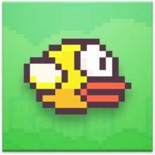

  <h1>Flappy Bird</h1>
  
  
Trabalho de desenvolvimento do jogo Flappy Bird em C++ por Bruno Ferreira Jimenez, Daniel Sansão Araldi, Enzo Luigi Schork e Jonathas Meine

  

### Descrição

> Flappy Bird é um jogo eletrônico para dispositivos móveis de 2013 desenvolvido em Hanói pelo programador vietnamita Nguyễn Hà Đông e publicado pela GEARS studios. O jogo foi publicado em maio de 2013 para o iPhone 5, e então atualizado para o iOS 7 em setembro de 2013. Em janeiro de 2014, ele ficou no topo da categoria de jogos gratuitos da iTunes App Store chinesa e americana, e mais tarde naquele mês da loja do Reino Unido, onde foi chamado de "o novo Angry Birds". Terminou o mês de janeiro como o aplicativo mais baixado da App Store. Existe uma versão para Windows 8 e Windows 8.1.

### Funcionamento

> O objetivo no jogo é ganhar o maior número possível de pontos, controlando um pássaro (tocando na tela) sem deixá-lo colidir nos canos. Se o pássaro tocar em algum obstáculo ou se deixar o pássaro cair, o jogo termina. Sempre que o personagem passa por um conjunto de canos, o jogador ganha um ponto.

### Desenvolvimento

- Problemas a serem solucionados:

1. ✅ O pássaro “deixa rastros”: Quando o pássaro é desenhado na sua nova posição, o jogo não apaga o desenho do pássaro da posição anterior.
2. ✅ O obstáculo “deixa rastros”: O obstáculo é desenhado em sua nova posição, mas o jogo não apaga o desenho da posição anterior do obstáculo.
3. ✅ Não é apresentado o placar em lugar nenhum da tela, mas o jogo deveria apresentar uma pontuação que aumenta a cada obstáculo superado.
4. ✅ Não existe tratamento de colisão, o pássaro não colide com o teto, chão ou com os obstáculos.

- Novas funcionalidades a serem implementadas:

1. ⛔️ Os obstáculos deverão ser escolhidos aleatoriamente com passagens: no meio, em cima e embaixo; (explicação sobre números aleatórios no final do documento).
2. ⛔️ O jogo deverá apresentar 2 obstáculos simultâneos com uma certa distância entre eles.
3. ⛔️ A velocidade do jogo deverá aumentar a cada 5 obstáculos superados.

**Obs.:** Para o desenvolvimento do código não poderão ser utilizadas variáveis compostas (arrays, structs) e funções.
